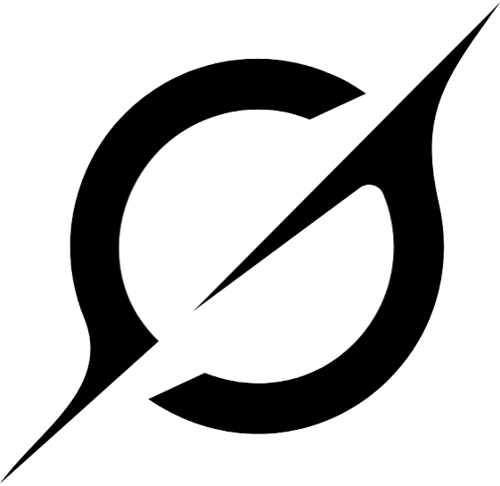

<p align="center">
  
</p>

<h1 align="center">Grok Workspace</h1>

<p align="center">
  <strong>Desktop workbench for the local Grok Build CLI</strong><br />
  Three surfaces — <strong>Build</strong>, <strong>Office</strong>, and <strong>Studio</strong> — one Tauri app, one agent, one project folder.
</p>

<p align="center">
  <a href="LICENSE"></a>
  
  
  
  
  
  <a href="https://github.com/HaydernCenterpoint/grok-workspace/releases"></a>
  <a href="https://github.com/HaydernCenterpoint/grok-workspace"></a>
</p>

<p align="center">
  <a href="https://github.com/HaydernCenterpoint/grok-workspace/releases/latest">Download</a>
  ·
  <a href="#run-from-source">Run from source</a>
  ·
  <a href="#first-run">First run</a>
  ·
  <a href="CHANGELOG.md">Changelog</a>
  ·
  <a href="CONTRIBUTING.md">Contributing</a>
</p>

> [!NOTE]
> **Grok Workspace is not an official xAI product.** It is an MIT-licensed desktop shell around the real [`grok`](https://x.ai) CLI (`grok agent stdio` / [ACP](https://agentclientprotocol.com/)). Agent work needs a working Grok Build install and a signed-in account (or a custom relay). Without the CLI you stay on the first-run wizard, or set `GROK_APP_ACP=mock` for UI-only development.

---

## What it is

The `grok` CLI is strong in a terminal. Daily work still needs a project sidebar, a permission bar, file previews, scheduled jobs, and a UI that is not a single chat box.

Grok Workspace is that workbench. Click the **sidebar Grok logo** to switch surface. The same trusted folder and the same ACP session stay bound — only the chrome changes.

| Surface | Mode | Job | What you see |
|---------|------|-----|----------------|
| **Grok Build** | `code` | Coding IDE | Chat + files, terminal, worktrees, skills, review, git chips. Host model / effort / access. |
| **Grok Office** | `office` | Papers, slides, sheets | Daily document work — **not** a Word / Excel / PowerPoint clone. Files + plan. Agent writes `*.office.json`; the app compiles `.docx` / `.xlsx` / `.pptx`. |
| **Grok Studio** | `studio` | Imagine image / video | Normal chat (thinking + result above the composer). Locked Imagine bar: image / video, aspect, resolution, duration. Official login or official API key required. |

Deep links: `#/office`, `#/studio`. Slash commands: `/office`, `/studio`, `/report`.

**Stack:** Tauri 2 + Rust host · React + TypeScript 7 + Vite · Tailwind.

---

## Contents

1. [Surfaces](#surfaces)
2. [Features](#features)
3. [Architecture](#architecture)
4. [Requirements](#requirements)
5. [Download](#download)
6. [Run from source](#run-from-source)
7. [First run](#first-run)
8. [Daily use](#daily-use)
9. [Account, models, and relays](#account-models-and-relays)
10. [Grok Office documents](#grok-office-documents)
11. [Grok Studio](#grok-studio)
12. [Appearance packs](#appearance-packs)
13. [Discord Rich Presence](#discord-rich-presence)
14. [Remote IM](#remote-im)
15. [Session data](#session-data)
16. [Config paths](#config-paths)
17. [Network / proxy](#network--proxy)
18. [Languages](#languages)
19. [Platform notes](#platform-notes)
20. [Build installers](#build-installers)
21. [Tests](#tests)
22. [Repository layout](#repository-layout)
23. [Contributing](#contributing)
24. [Security](#security)
25. [License](#license)

---

## Surfaces

### Grok Build

Default coding workbench. The host owns the session state machine and talks to `grok agent stdio`. You get:

- Trusted project folders and a virtualized session sidebar (archive, fork, rewind)
- Multi-session streams that keep running after you switch chats
- Ask by default; allow once / session / deny; YOLO when you want unattended runs
- Plan / Goal progress, slash palette, Skills, MCP / plugins
- Bottom PTY + side terminal, git worktrees, session diffs
- Image / video / PDF / Office / code preview in Resources

### Grok Office

A **different UI**, not Build with a different placeholder. Office hides kanban, terminal, worktrees, skills, review, and git chips. Chat + files stay.

The agent does not hand-author OOXML. It writes a small IR (`*.office.json`: `paper` / `sheet` / `deck`). Opening that file previews the report, table, or slides and can export Word, Excel, or PowerPoint. `/report` opens Office on the current Build folder and starts a project report. Existing `.xlsx` / `.pptx` can be captured back into JSON.

Office keeps its own model / access prefs in `localStorage` and does **not** write Host `composer_prefs_*`. Switching back to Build restores Host prefs.

### Grok Studio

Imagine on a normal transcript — not a side canvas with “Generating…” under the box. Composer stays docked. Studio never activates custom providers (that would hijack Build’s route) and does not write Host composer prefs.

Official Grok login or an official API key is required. Send goes through the current ACP session; the agent calls official-aux `image_gen` / `image_to_video`.

---

## Features

| Area | What you get |
|------|----------------|
| **Real Build sessions** | Default `grok agent stdio` (ACP); host-owned FSM; optional remote ACP server |
| **Projects & sessions** | Trusted dirs, import / continue CLI sessions, orphan cleanup, fork from an assistant reply |
| **Permissions** | Per-project policy; in-app confirms only (no `window.confirm` / `alert`) |
| **Composer** | Follow-up queue while busy; paste screenshots; context-usage chip |
| **Find** | In-chat find (`Ctrl+F`) stays on the transcript island |
| **Automations** | Scheduled list; create-from-chat; tray-only is enough for the scheduler |
| **Account & quota** | Official login, SuperGrok quota + heatmap, custom relays |
| **Custom relays** | Independent `GROK_HOME` (`~/.grok-app/agent-home`) so App does not rewrite `~/.grok` |
| **Extra headers** | Per-provider HTTP headers (`User-Agent`, `x-api-key`, …) written to Grok Build `extra_headers` |
| **Appearance** | Skins (`.grokskin`), wallpaper crop, zen mode — apply always confirms first |
| **Workbench chrome** | Codex-style solid panes + docked composer by default; Classic (floating + glass) is optional |
| **Remote IM** | Optional Bridge channels (Discord bot, Telegram, …) — separate from Rich Presence |
| **Discord Presence** | Project · surface · plan · progress · elapsed time (desktop Discord) |
| **Security** | Optional OS keychain; `secrets.json` `0600` fallback; never commit `auth.json` |
| **i18n** | 13 shipped locales. Follows the OS language. Chinese OS → English for now |
| **Packaging** | Windows x64 setup + portable zip · macOS ARM/Intel `.dmg` · Linux AppImage / `.deb` / `.rpm` |

---

## Architecture

```text
┌─────────────────────────────────────────────┐
│  Grok Workspace (this app)                  │
│  Tauri 2 host + React workbench             │
│  Surfaces: Build · Office · Studio          │
└──────────────────┬──────────────────────────┘
                   │ ACP JSON-RPC over stdio
                   ▼
┌─────────────────────────────────────────────┐
│  Grok Build CLI  (`grok agent stdio`)       │
│  Tools, sampling, login, models             │
└──────────────────┬──────────────────────────┘
                   │
                   ▼
         xAI official  /  custom relay
```

The desktop app is **not** a second model runtime. It does not reimplement tools or sampling. It is an ACP client, a permission UI, and three work surfaces on top of the CLI you already use in a terminal.

Default session home is **shared** (`GROK_HOME=~/.grok`). Independent mode uses `~/.grok-app/agent-home` and is the only mode where the app rewrites agent `config.toml` (custom providers, privacy, workflows).

---

## Requirements

| Piece | Details |
|-------|---------|
| **Grok Build CLI** | `0.2.112+` (product line 1.0+ recommended). Typical paths: `~/.grok/bin/grok`, `%USERPROFILE%\.grok\bin\grok.exe`, or `PATH`. Older CLIs reject flags this app sends. After `grok update`, fully quit and reopen the app. |
| **Windows** | [WebView2](https://developer.microsoft.com/microsoft-edge/webview2/) (ships on Windows 11). Native Rust build needs **MSVC** (`vcvars64.bat`). |
| **macOS** | Xcode Command Line Tools. |
| **From source** | Node 22+, pnpm 9 (`packageManager` is `pnpm@9.15.9`), Rust stable (MSVC on Windows). |

This repository ships installers on [GitHub Releases](https://github.com/HaydernCenterpoint/grok-workspace/releases). You can also run from source or package locally with [docs/BUILD.md](docs/BUILD.md).

---

## Download

Latest bits: **[github.com/HaydernCenterpoint/grok-workspace/releases/latest](https://github.com/HaydernCenterpoint/grok-workspace/releases/latest)**

| Platform | Asset |
|----------|--------|
| Windows x64 | `*-setup.exe` installer, plus `Grok_*_x64-portable.zip` (no install; still needs WebView2 + CLI) |
| macOS Apple Silicon | `.dmg` (`aarch64`) |
| macOS Intel | `.dmg` (`x64`) |
| Linux x64 | AppImage + `.deb` + `.rpm` |

v1.0.0 is the first public Grok Workspace tag. Windows x64 is built on the maintainer machine; macOS / Linux land when Actions is green.

Unsigned builds will trip Windows SmartScreen and macOS Gatekeeper. That is expected until signing secrets are configured. See [Platform notes](#platform-notes).

---

## Run from source

Clone this repository (not a third-party fork):

```bash
git clone https://github.com/HaydernCenterpoint/grok-workspace.git
cd grok-workspace
pnpm install
```

Use **pnpm only** at the repo root. Do not run `npm install` / `yarn` here — that regenerates a stale `package-lock.json`.

### Windows (PowerShell)

Load MSVC, then start the desktop host. Do **not** put Git’s `usr\bin` ahead of MSVC on `PATH` or Rust will pick Git’s Unix `link.exe` and the release build will fail.

```powershell
$vcvars = Join-Path ${env:ProgramFiles(x86)} "Microsoft Visual Studio\18\BuildTools\VC\Auxiliary\Build\vcvars64.bat"
cmd /c "call `"$vcvars`" && pnpm dev"
```

Release installer (same rule — `vcvars` must stay on `PATH`):

```powershell
$vcvars = Join-Path ${env:ProgramFiles(x86)} "Microsoft Visual Studio\18\BuildTools\VC\Auxiliary\Build\vcvars64.bat"
cmd /c "call `"$vcvars`" && pnpm exec tauri build --target x86_64-pc-windows-msvc"
```

### macOS / Linux

```bash
pnpm dev                 # full desktop app (real CLI by default)
pnpm dev:ui              # Vite only
GROK_APP_ACP=mock pnpm dev
```

Vite HMR updates the UI only. Rust Host commands (Office export, Discord IPC, …) need a Host rebuild — fully quit `pnpm dev` and start it again.

---

## First run

1. Launch → setup wizard **requires** a working `grok` binary (install from the wizard or pick a path). Account / API key / relay is **skippable**.
2. If the CLI is already signed in, choose **Use existing CLI sign-in**.
3. **Add project** → trust a folder.
4. **Connect agent** → chat when Ready. Permission bar defaults to **Ask**.
5. Sidebar logo → switch Build / Office / Studio.

Windows can run the CLI through **WSL** (Settings → Runtime → CLI). An ACP server address still wins when set.

---

## Daily use

| Action | How |
|--------|-----|
| New chat | Sidebar / command palette |
| Switch surface | Sidebar Grok logo |
| Settings | `Ctrl+,` (press again or Esc to return) |
| Shortcuts help | `Ctrl+/` |
| Toggle left rail | `Ctrl+B` |
| Toggle right tools | `Ctrl+Alt+B` |
| Bottom terminal | `` Ctrl+` `` |
| In-chat find | `Ctrl+F` |
| Write a project report | `/report` or palette **Write project report** |
| Open Office / Studio | `/office` · `/studio` · `#/office` · `#/studio` |

Close the window to hide to the tray (Windows default). Quit from the tray menu.

---

## Account, models, and relays

Sign-in is the **same** Grok Build CLI auth (`grok login`), not a parallel OAuth stack.

| Channel | Source |
|---------|--------|
| Official OAuth | `~/.grok/auth.json` via `grok login` |
| Official API key | App secrets (`officialApiKey`; OS keychain preferred) |
| Custom relay | OpenAI-compatible base URL + key, written to `$GROK_HOME/config.toml` as `[model.<id>]` |

Composer shows **official models** (`grok-4.6` default, plus `grok-4.5`). Providers are a channel, switched in Settings → Account → Providers — not a second model picker on the official route.

Official effort steps: low / medium / high / extra-high (`xhigh` on Grok 4.6). Custom relays can declare their own effort list and extra request headers.

**Custom route + official login:** keep `~/.grok/auth.json` for billing / official-aux, but do not copy it into a custom main agent-home. Otherwise the CLI may send the official token to the relay.

---

## Grok Office documents

Office is daily knowledge work. The model writes JSON; the app compiles Office files.

| `kind` | Compile to |
|--------|------------|
| `paper` | Markdown + `.docx` |
| `sheet` | CSV + `.xlsx` (formulas are strings starting with `=`) |
| `deck` | Markdown + `.pptx` |

Entering Office installs a project skill at `.grok/skills/grok-office/SKILL.md` so the model does not unzip OOXML by hand. Opening `*.office.json` in the files pane previews the artifact and offers Save Word / Excel / PowerPoint. Existing `.xlsx` / `.pptx` can be captured back into a sibling JSON.

---

## Grok Studio

Studio is Imagine, in the same chat column as Build.

- Bar is locked to Imagine: image or video, aspect, resolution, duration.
- No Build workspace / model / effort / Full-access chips.
- Thinking and the media card stay **above** the composer.
- Needs official login or official API key.

---

## Appearance packs

Settings → Appearance can save, import, and export the current skin + wallpaper + crop + clip + overlay as a `.grokskin` pack.

- Apply **always confirms** first. Nothing auto-applies.
- `grok://` and `.grokskin` files write a pending import slot only.
- Export bakes the visible wallpaper crop (video uses system ffmpeg when present).

Default chrome is the Codex-style workbench (solid panes, docked composer). Settings → Appearance → Interface can restore Classic (floating composer + glass).

---

## Discord Rich Presence

When Discord desktop (Stable / PTB / Canary) is running, the app can show:

```text
{project} · {Grok Build | Office | Studio}
{plan} · {idle | working | waiting | connecting} [· context %]
```

plus elapsed time from process start.

Toggle: **Settings → General → App → Show status on Discord** (on by default).

Discord only accepts a real **Application ID**. Create an app named **Grok Workspace** at the [Discord Developer Portal](https://discord.com/developers/applications), paste the ID in that Settings row, and keep **Display current activity** on (not Invisible). Vite HMR does not load new Host commands — fully quit and restart after changing this.

This is **not** Remote IM and not a Discord bot. The app never sends tokens, paths, or prompts to Discord.

---

## Remote IM

Optional Bridge (Discord bot, Telegram, and other channels) is a **separate** product surface from Rich Presence. Configure it in the app; see [docs/llm-wiki/remote-im.md](docs/llm-wiki/remote-im.md). Turning Presence on does not start a bot.

---

## Session data

| Mode | `GROK_HOME` | Notes |
|------|-------------|--------|
| **Shared** (default) | `~/.grok` | Same home as terminal Grok Build. App **refuses** to rewrite `config.toml` there. |
| **Independent** | `~/.grok-app/agent-home` | App may write providers, privacy, workflows. |

Do not leave relay keys only in App secrets if you expect the CLI to see them in shared mode.

Pasted UUIDs default to **Grok Workspace session ids**, not CLI agent ids.

---

## Config paths

Override the app data root with **`GROK_APP_HOME`**.

| Platform | Typical path |
|----------|----------------|
| Windows | `%APPDATA%\grokapp\grok-app\` |
| macOS | `~/Library/Application Support/com.grokapp.grok-app/` |
| Fallback | `~/.grok-app/` |

```text
<app-data>/
  projects.json
  sessions_index.json
  settings.json
  secrets.json
  automations.json
  projects/
  sessions/
  logs/
  agent-home/          # independent-mode GROK_HOME
```

CLI login stays in **`~/.grok`** (`auth.json`, …). Never commit `auth.json`, `.env`, or `secrets.json`.

---

## Network / proxy

`auth.x.ai` / `grok.com` / `cli-chat-proxy.grok.com` may need a proxy.

1. **Settings → Runtime → Network** — System or Manual (e.g. `http://127.0.0.1:7890`), then **Test connection**.
2. Prefer System HTTP or a mixed-port proxy over TUN. The app injects `HTTP_PROXY` into agent processes.
3. If the CLI is already signed in, reuse it instead of Browser OAuth.

---

## Languages

The UI follows the OS language by default (Settings can pin a locale).

Shipped: `de` `en` `es` `fil` `fr` `id` `it` `ja` `ko` `pt-BR` `ru` `ta` `uk`.

`zh` / `zh-TW` catalogs stay on disk but are **unshipped** — a Chinese OS opens in English. Speech-to-text Chinese options are unchanged.

English is the catalog authority. Product strings go through `src/i18n/`. See [docs/llm-wiki/i18n.md](docs/llm-wiki/i18n.md).

---

## Platform notes

**Windows**

- Close-to-tray is the default hide; quit from the tray.
- Optional taskbar unread overlay is **off** by default (Settings → General → App).
- SmartScreen may warn on unsigned `*-setup.exe` → More info → Run anyway.
- Win+Right snap uses half the current monitor work area on short displays.

**macOS Gatekeeper** (unsigned / quarantined local builds):

```bash
xattr -cr /Applications/Grok\ Workspace.app
```

**Linux AppImage + Wayland (black window):** bundled WebKit can fail (`EGL_BAD_PARAMETER`). Prefer `.deb` / `.rpm` (system WebKit), or extract the AppImage and point `WEBKIT_EXEC_PATH` at system `webkit2gtk-4.1`. See [Tauri Linux graphics](https://v2.tauri.app/develop/debug/linux-graphics/).

**Linux sandbox (`SANDBOX_BLOCKED`):** Ubuntu 24.04+ may set `kernel.apparmor_restrict_unprivileged_userns=1`, which breaks bubblewrap. Fix with sysctl, or **Settings → Runtime → Sandbox → off**.

---

## Build installers

```bash
pnpm build:help          # list targets
pnpm build:win           # Windows x64 NSIS (this machine, with MSVC)
pnpm build:mac           # this Mac
pnpm build:linux         # Linux host only
```

Artifacts land under `src-tauri/target/<triple>/release/bundle/`. Do not commit `src-tauri/target/` or `dist-installers/`.

Full matrix, signing, and updater notes: [docs/BUILD.md](docs/BUILD.md). Release checklist: [docs/llm-wiki/release.md](docs/llm-wiki/release.md).

---

## Tests

```bash
pnpm typecheck
pnpm test
pnpm lint
cd src-tauri && cargo test
```

Product rules for agents live in [docs/llm-wiki/](docs/llm-wiki/). History: [CHANGELOG.md](CHANGELOG.md).

---

## Repository layout

```text
grok-workspace/
  src/                 React workbench (surfaces, settings, i18n)
  src-tauri/           Rust host (ACP, Office pack, Discord IPC, FS)
  remote-bridge/       Optional Remote IM bridge
  docs/BUILD.md        Local / CI packaging
  docs/llm-wiki/       Product rules (i18n, Office, Studio, Presence, …)
  docs/assets/         README images (Grok mark)
  scripts/             Release, changelog, portable zip
  CHANGELOG.md         Keep a Changelog
```

Identifier is still `com.grokapp.desktop`. App data stays under `grokapp\grok-app` so existing local settings survive the rename.

---

## Contributing

Issues and PRs are welcome. See [CONTRIBUTING.md](CONTRIBUTING.md) and [CODE_OF_CONDUCT.md](CODE_OF_CONDUCT.md).

```bash
pnpm install
pnpm dev
pnpm typecheck && pnpm test
```

<!-- CONTRIBUTORS:START -->
<p align="center">
  <a href="https://github.com/HaydernCenterpoint"></a>
</p>
<!-- CONTRIBUTORS:END -->

---

## Security

Please report vulnerabilities privately as described in [SECURITY.md](SECURITY.md). Do not file public issues that include tokens, `auth.json`, or `secrets.json`.

---

## License

[MIT](LICENSE)

Unofficial. Not affiliated with xAI. Grok is a trademark of its owner. You need a working Grok Build CLI and an account (or a relay you control) for agent sessions.
